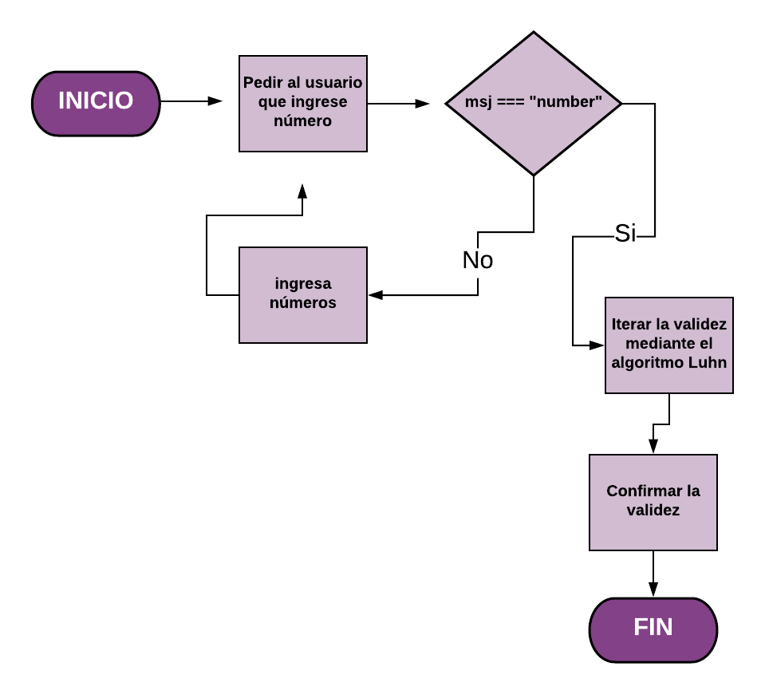

# TARJETA DE CRÉDITO VÁLIDA
-Para validar una tarjeta de crédito se emplea con ayuda del algoritmo Luhn, ya que esté es una fórmula de suma de verificación que es utilizada para validar una diversidad de  números de identificación, en esté caso los números de una tarjeta de crédito.
### Trabajo a realizar
Crea una web que pida, por medio de un prompt(), el número de una tarjeta de crédito
 y confirme su validez según el algoritmo de Luhn.
#### Consideraciones Específicas
Tu código debe estar compuesto por 1 función: isValidCard
El usuario no debe poder ingresar un campo vacío
##  Pseudocódigo
1. Por medio de un prompt pedir al usuario que ingrese número de tarjeta
2. Crear una función que valide que lo que ingrese sean numbers
3. Crear un arreglo donde se guarde la cadena
4. Iterar el arreglo según el algoritmo de Luhn
5. confirmar su validez

## Diagrama de Flujo

